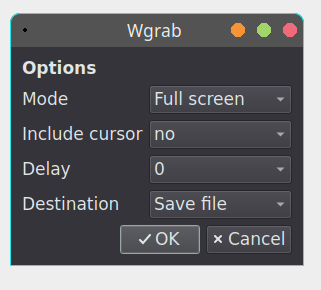

# Wshot

Simple screenshot GUI for wayland.



## Depends

- grim
- slurp
- zenity|qarma
- jq
- wl-clipboard

## Install

```
git clone https://github.com/stefonarch/Wshot.git
cd Wshot
sudo cp ./wshot /usr/local/bin/
sudo cp ./wshot.desktop /usr/local/share/applications/
```


## Usage

By default screenshots are saved to `~/tmp/screenshot_*`, edit `FILEDIR=` in `wshot` to change.


