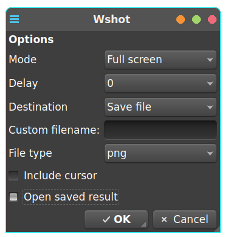

# Wshot

>Simple Qt screenshot GUI for wayland.



## Depends

* grim
* slurp
* qarma
* wl-clipboard

### Optional

* wf-info (to select window under wayfire)
* jq (to select window under sway)

## Install

```
git clone https://github.com/stefonarch/wshot.git
cd wshot
sudo cp ./wshot /usr/local/bin/
sudo cp wshot.png /usr/share/pixmaps/
sudo cp wshot.desktop /usr/share/applications
```

## Usage

By default screenshots are saved to `~/tmp/screenshot_*`, edit `FILEDIR=` in `wshot` to change.

If no custom filename is set it defaults to `screenshot_$(date +%F_%H.%M.%S)` e.g. `screenshot_2023-08-07_11.37.18`.

**Note**: "Selected window" mode is working only in sway and wayfire at the moment.


Not tested using zenity instead of qarma.

## Licenses

Wshot is licensed under the [GPL3](COPYING) license. <br/>
Icon comes from the [nuoveXT2.2](https://www.deviantart.com/sa-ki/art/nuoveXT-2-53518454) icon set by sa-ki, LGPL3 license.
